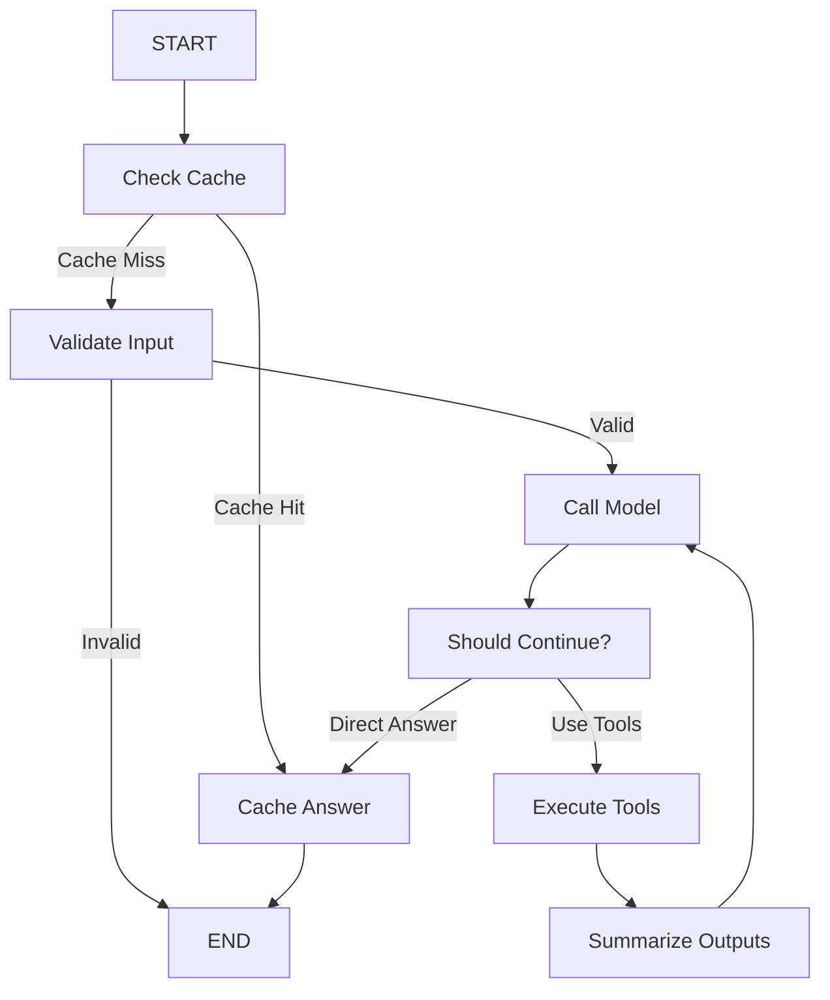

# 🚀 S2thon E-Commerce AI Backend

Modern FastAPI tabanlı AI-destekli e-ticaret backend sistemi. LangGraph ile gelişmiş sohbet robotu, Gemini AI entegrasyonu, Supabase veritabanı ve çoklu AI servisleri içerir.

## 📋 İçindekiler

- [Proje Mimarisi](#-proje-mimarisi)
- [Temel Özellikler](#-temel-özellikler)
- [Kurulum](#-kurulum)
- [API Endpoints](#-api-endpoints)
- [LangGraph AI Asistanı](#-langgraph-ai-asistanı)
- [Teknoloji Stack](#-teknoloji-stack)
- [Dizin Yapısı](#-dizin-yapısı)
- [Güvenlik](#-güvenlik)
- [Kullanım Örnekleri](#-kullanım-örnekleri)
- [Geliştirme](#-geliştirme)

## 🏗️ Proje Mimarisi

Bu proje modüler bir FastAPI microservice mimarisi kullanır:

```
ai-service/
├── main.py                 # FastAPI uygulaması
├── routers/               # API endpoint'leri
├── services/              # İş mantığı servisleri
├── data/documents/        # AI için bilgi kaynakları
└── visualize_graph.py     # LangGraph workflow görselleştirici
```

### 🎯 Ana Bileşenler

1. **LangGraph AI Asistanı** - Akıllı sohbet robotu
2. **Ürün Açıklama Oluşturucu** - AI tabanlı ürün açıklamaları
3. **Fiyat Analiz Servisi** - Rekabetçi fiyat analizi
4. **Görsel Oluşturucu** - AI ile ürün görselleri
5. **Supabase Entegrasyonu** - Veritabanı ve storage

## ✨ Temel Özellikler

### 🤖 AI Destekli Sohbet Robotu
- **LangGraph** ile gelişmiş iş akışı
- **Cache-first** mimari (performans optimizasyonu)
- **Input validasyonu** ve güvenlik
- **Tool execution** (veritabanı, API çağrıları)
- **Intelligent summarization** (akıllı özetleme)

### 📝 Ürün Yönetimi
- AI ile ürün açıklaması oluşturma
- Fiyat karşılaştırma ve analiz
- Ürün görseli oluşturma
- Stok durumu takibi

### 🔐 Güvenlik
- JWT token tabanlı kimlik doğrulama
- User-specific işlemler
- Rate limiting hazır altyapı
- Secure API endpoints

### 🎨 Modern Tasarım
- LangSmith stilinde dark mode UI
- Professional workflow diyagramları
- Real-time görselleştirme

## 🚀 Kurulum

### Gereksinimler
- Python 3.8+
- PostgreSQL
- Supabase hesabı
- API anahtarları (Gemini, Stability AI)

### 1. Klonlama ve Bağımlılıklar
```bash
git clone <repo-url>
cd backend-fastapi/ai-service
pip install -r requirements.txt
```

### 2. Ortam Değişkenleri
`.env` dosyası oluşturun:
```env
# AI API Keys
GEMINI_API_KEY=your_gemini_api_key
STABILITY_API_KEY=your_stability_api_key

# Supabase
SUPABASE_URL=your_supabase_url
SUPABASE_KEY=your_supabase_key

# Database
DB_HOST=localhost
DB_PORT=5432
DB_NAME=your_db_name
DB_USER=your_db_user
DB_PASSWORD=your_db_password

# JWT
JWT_SECRET_KEY=your_jwt_secret
```

### 3. Çalıştırma
```bash
uvicorn main:app --reload --port 8000
```

## 🌐 API Endpoints

### 🤖 Chatbot
```http
POST /chat
Content-Type: application/json
Authorization: Bearer <token>

{
  "message": "Kullanıcı mesajı",
  "user_id": "12345"
}
```

### 📝 Ürün Açıklaması
```http
POST /generate-description
Content-Type: application/json
Authorization: Bearer <token>

{
  "name": "Ürün Adı",
  "category": "Kategori"
}
```

### 💰 Fiyat Analizi
```http
POST /analyze-price
Content-Type: application/json
Authorization: Bearer <token>

{
  "name": "Ürün Adı",
  "price": 100.50,
  "category": "Kategori"
}
```

### 🎨 Görsel Oluşturma
```http
POST /preview-image
Content-Type: application/json
Authorization: Bearer <token>

{
  "product_name": "Ürün Adı",
  "style_preferences": "Modern, minimalist"
}
```

## 🧠 LangGraph AI Asistanı

### Workflow Mimarisi



### Ana Düğümler

1. **Cache Check**: Önbellek kontrolü
2. **Validate Input**: Giriş doğrulama
3. **Call Model**: AI model çağrısı
4. **Should Continue**: Karar verme
5. **Execute Tools**: Araç çalıştırma
6. **Summarize Outputs**: Çıktı özetleme

### Mevcut Araçlar

- `get_product_info_tool` - Ürün bilgisi getirme
- `get_recommendations_tool` - Ürün tavsiyeleri
- `search_documents_tool` - Doküman arama
- `get_user_orders_tool` - Kullanıcı siparişleri

## 🛠️ Teknoloji Stack

### Backend Framework
- **FastAPI** - Modern, hızlı web framework
- **Pydantic** - Veri validasyonu
- **Uvicorn** - ASGI server

### AI & ML
- **LangGraph** - AI workflow orchestration
- **LangChain** - AI framework
- **Google Gemini** - Ana AI modeli
- **Stability AI** - Görsel oluşturma

### Veritabanı & Storage
- **Supabase** - PostgreSQL + Storage
- **FAISS** - Vector search
- **Redis** (opsiyonel) - Cache

### Güvenlik
- **JWT** - Token tabanlı auth
- **bcrypt** - Şifre hashleme
- **python-jose** - JWT işlemleri

## 📁 Dizin Yapısı

```
ai-service/
├── main.py                          # FastAPI app entry point
├── requirements.txt                 # Python dependencies
├── visualize_graph.py              # LangGraph visualizer
├── routers/                        # API endpoints
│   ├── chatbot.py                  # Chat API
│   ├── description.py              # Description generation
│   ├── image_gen.py               # Image generation
│   └── price_analyzer.py          # Price analysis
├── services/                       # Business logic
│   ├── supabase_client.py         # Database client
│   ├── description_gen.py         # AI description service
│   ├── image_gen.py              # AI image service
│   ├── price_analyzer.py         # Price analysis service
│   └── langgraph_agent/          # LangGraph AI system
│       ├── __init__.py           # Main orchestrator
│       ├── graph_state.py        # Shared state
│       ├── tools.py              # AI tools
│       ├── vector_store.py       # FAISS vector DB
│       ├── security.py           # JWT auth
│       └── nodes/                # Workflow nodes
│           ├── check_cache.py
│           ├── validate_input.py
│           ├── call_model.py
│           ├── enhanced_should_continue.py
│           ├── tool_executor.py
│           ├── summarize_tool_outputs.py
│           └── cache_final_answer.py
└── data/documents/                 # Knowledge base
    ├── faq.txt                    # Frequently asked questions
    └── policy.txt                 # Policies and terms
```

## 🔐 Güvenlik

### JWT Authentication
```python
from services.langgraph_agent.security import get_current_user_claims

@router.post("/protected-endpoint")
async def protected_route(
    claims: UserClaims = Depends(get_current_user_claims)
):
    user_id = claims.user_id
    # Kullanıcı kimliği doğrulandı
```

### User-Specific Operations
Tüm işlemler kullanıcı kimliği ile ilişkilendirilir:
- Sohbet geçmişi
- Ürün işlemleri
- Cache yönetimi
- Sipariş takibi

## 💡 Kullanım Örnekleri

### 1. Sohbet Robotu Kullanımı
```python
# Client tarafında
response = requests.post(
    "http://localhost:8000/chat",
    headers={"Authorization": f"Bearer {token}"},
    json={
        "message": "En popüler ürünleri göster",
        "user_id": "user123"
    }
)
```

### 2. Ürün Açıklaması Oluşturma
```python
response = requests.post(
    "http://localhost:8000/generate-description",
    headers={"Authorization": f"Bearer {token}"},
    json={
        "name": "iPhone 15 Pro",
        "category": "Electronics"
    }
)
```

### 3. Workflow Görselleştirme
```bash
python visualize_graph.py
```

## 🔧 Geliştirme

### Yeni AI Tool Ekleme
```python
# services/langgraph_agent/tools.py
@tool
def new_custom_tool(query: str, user_id: str) -> str:
    """Yeni özel araç açıklaması"""
    # İmplementasyon
    return result

# tools.py'nin sonuna ekle
all_tools.append(new_custom_tool)
```

### Yeni Node Ekleme
```python
# services/langgraph_agent/nodes/new_node.py
def new_node(state: GraphState) -> dict:
    """Yeni düğüm implementasyonu"""
    # İş mantığı
    return {"messages": [new_message]}

# nodes/__init__.py'ye ekle
all_nodes["new_node"] = new_node
```

### API Endpoint Ekleme
```python
# routers/new_router.py
from fastapi import APIRouter, Depends
from ..services.langgraph_agent.security import get_current_user_claims

router = APIRouter()

@router.post("/new-endpoint")
async def new_endpoint(
    data: RequestModel,
    claims: UserClaims = Depends(get_current_user_claims)
):
    # İmplementasyon
    return {"result": "success"}
```

## 📊 İzleme ve Loglar

### Sistem Logları
- ✅ AI model çağrıları
- ✅ Veritabanı işlemleri
- ✅ Cache hit/miss oranları
- ✅ Kullanıcı aktiviteleri

### Performance Metrics
- Response time tracking
- Cache efficiency
- AI model accuracy
- Error rates

## 🚀 Deployment

### Docker (Önerilen)
```dockerfile
FROM python:3.11-slim

WORKDIR /app
COPY requirements.txt .
RUN pip install -r requirements.txt

COPY . .
EXPOSE 8000

CMD ["uvicorn", "main:app", "--host", "0.0.0.0", "--port", "8000"]
```

### Production Checklist
- [ ] Environment variables güvenli şekilde ayarlandı
- [ ] Database connection pooling aktif
- [ ] Rate limiting implementasyonu
- [ ] Monitoring ve alerting
- [ ] Backup stratejisi

## 🤝 Katkıda Bulunma

1. Fork edin
2. Feature branch oluşturun (`git checkout -b feature/amazing-feature`)
3. Commit edin (`git commit -m 'Add amazing feature'`)
4. Push edin (`git push origin feature/amazing-feature`)
5. Pull Request oluşturun

## 📝 Lisans

Bu proje MIT lisansı altında lisanslanmıştır.

## 🆘 Destek

- 📧 Email: destek@s2thon.com
- 💬 AI Asistanı: Uygulama içinde
- 📚 Dokümantasyon: Bu README

---

**S2thon E-Commerce AI Backend** - Modern AI teknolojileri ile güçlendirilmiş e-ticaret deneyimi.